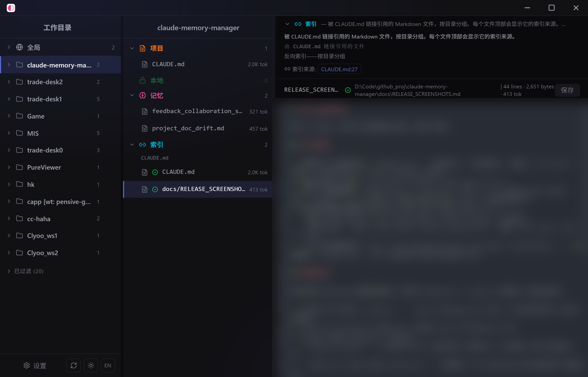
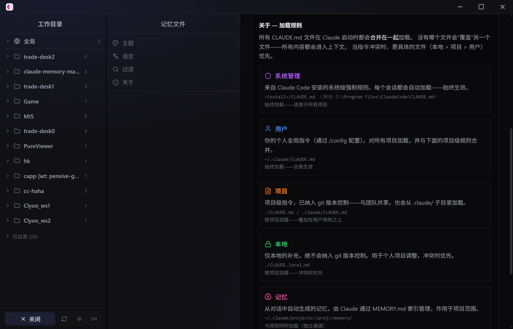
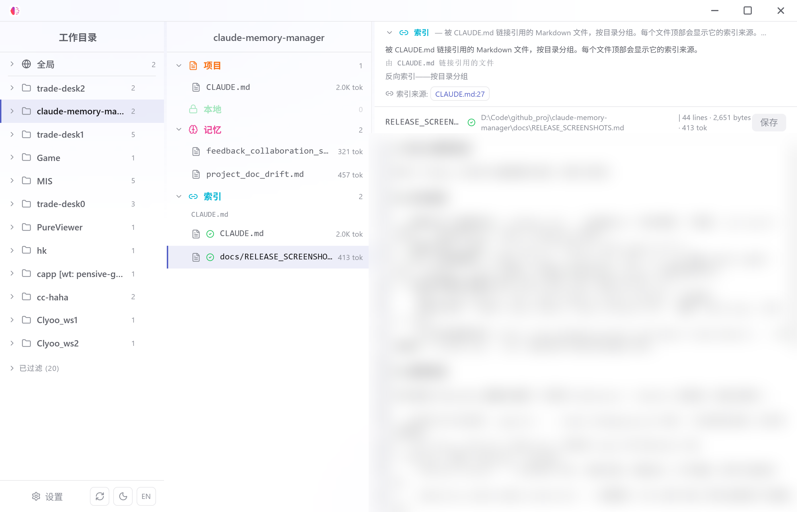
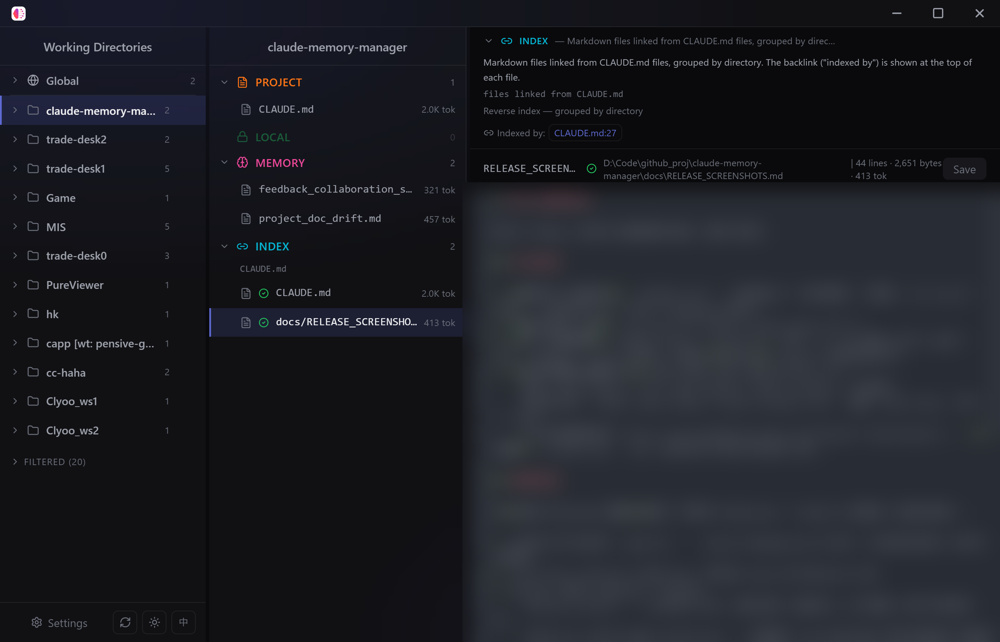
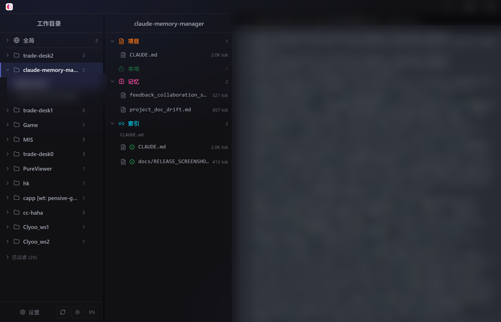

# CC Memory

Claude Code 记忆文件管理器 —— 可视化查看、编辑和管理 Claude Code 的记忆文件（`CLAUDE.md` 与 Memory）。

> **CC Memory** is a desktop app for viewing, editing and managing Claude Code's memory files (`CLAUDE.md` & Memory) across all your projects.


---

## 简介 / Overview

CC Memory 是一个 Electron 桌面应用，让你用可视化的方式管理 Claude Code 在所有项目里生成的记忆文件：

- 浏览所有 Claude Code 项目（当前及历史）
- 分门别类查看每类记忆文件：**Managed / User / Project / Local / Memory**
- 在线编辑 `CLAUDE.md` 和记忆文件，保存即写入磁盘
- 查看每条 Session 的原始 JSONL 数据
- 清楚看到每类文件**如何被加载**、加载路径与优先级

**English:** CC Memory is an Electron desktop app that helps you manage Claude Code's memory files across all your projects with a visual interface — browse projects, view each type of CLAUDE.md / memory file, edit them inline, inspect raw session JSONL, and understand exactly how each file type is loaded (path & priority).

## 截图 / Screenshots

| 主界面 · 暗色 · 中文 | 加载规则说明 · 中文 |
|---|---|
|  |  |

| 亮色主题 · 中文 | 英文界面 | Session JSONL |
|---|---|---|
|  |  |  |

## 功能 / Features

- 🌐 **中英文切换** —— 一键在 中文 / English 之间切换，界面与加载规则说明随之本地化
- 🌓 **暗 / 亮主题** —— 跨平台主题切换（macOS / Windows / Linux），自动记忆你的选择
- 🗂️ **五类记忆文件** —— Managed / User / Project / Local / Memory，分类清晰，一目了然
- ✏️ **在线编辑** —— 直接在应用里修改 `CLAUDE.md` 与记忆文件，保存即写入磁盘
- 📜 **加载规则说明** —— 每种文件的加载路径、优先级与合并规则都有清晰说明
- 🧾 **Session JSONL** —— 查看每次会话的原始数据，便于调试与分析
- 🖥️ **三平台支持** —— Windows / macOS / Linux

## 下载安装 / Download & Install

从 **GitHub Releases** 下载对应平台的安装包：

| 平台 | 安装包 |
|---|---|
| macOS · Apple Silicon | `CC-Memory-0.2.0-arm64.dmg` |
| macOS · Intel | `CC-Memory-0.2.0-x64.dmg` |
| Windows | `CC-Memory-Setup-0.2.0-x64.exe` |
| Linux | `CC-Memory-0.2.0-x86_64.AppImage` / `.deb` / `.rpm` |

> **Download:** Get the latest installer from [GitHub Releases](https://github.com/hi-clyoo/CCMemory/releases/latest).

> ⚠️ **macOS 注意 / macOS note:** 当前版本未签名。首次打开若提示“无法验证开发者”，请 **右键点击应用 → 打开**，或到「系统设置 → 隐私与安全性」中允许运行。
> The current build is unsigned. If Gatekeeper blocks it, **right-click the app → Open**, or allow it in System Settings → Privacy & Security.

## 开发 / Development

```bash
pnpm install          # 安装依赖
pnpm dev              # 启动开发服务器（端口 9015）
pnpm build            # 生产构建
pnpm typecheck        # 类型检查
pnpm test             # 运行测试
```

## 构建与发布 / Building & Releasing

推送 `v*` 标签即可自动构建并发布三平台安装包（GitHub Actions）：

```bash
git tag v0.2.0
git push origin v0.2.0
```

CI 会自动构建 macOS（arm64 + x64）、Windows、Linux 的安装包，并创建一个 **draft Release**，供你核对后转正式发布。

## 技术栈 / Tech Stack

Electron 40 · React 18 · TypeScript 5 · CodeMirror 6 · Tailwind CSS 3 · Zustand 4 · electron-vite

## License

[MIT](LICENSE)
